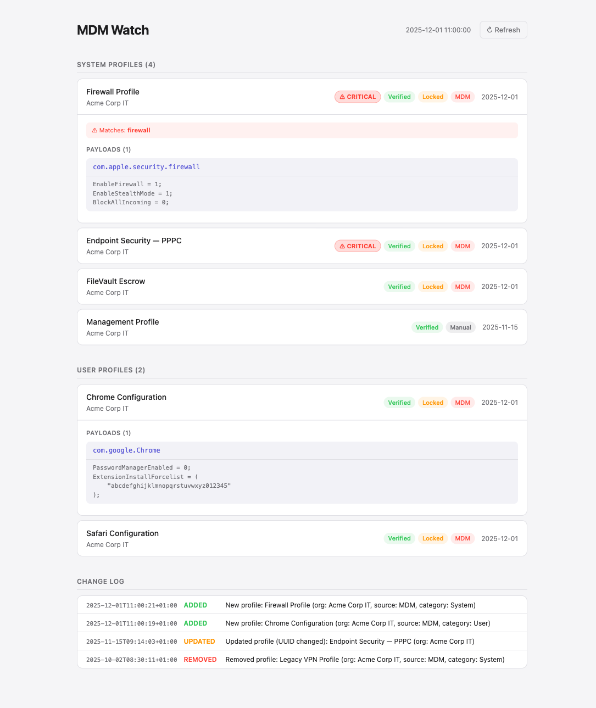

# mdm-watch

A small macOS daemon that monitors system configuration profiles and alerts you when your MDM pushes something new.

## What it does

- Detects added, removed, or updated configuration profiles (MDM and manual)
- Sends a clickable macOS notification — tap it to open the web UI with full details
- Marks profiles that have elevated access as **⚠ CRITICAL** (DLP, firewall, PPPC, network filters, VPN, etc.)
- Shows payload contents: what each profile actually controls (Chrome policies, Safari settings, certificates, FileVault escrow, firewall rules)
- Keeps a change log of everything that has ever been installed or removed

## Web UI

```
mdm-watch serve
```

Opens `http://localhost:8765` — three sections:

| Section | What's here |
|---|---|
| System profiles | MDM device configuration (firewall, certificates, endpoint security) |
| User profiles | Per-user policies (browser settings, managed preferences) |
| Provisioning profiles | App signing profiles with entitlements and certificates |

Each card is expandable — click to see payload bundle IDs, raw policy data, UUIDs, and install date.



## Install

### Option A — Download release (recommended)

Go to [Releases](https://github.com/dzarlax/mdm-watch/releases/latest), download the zip, unzip and run:

```bash
cd mdm-watch-dist
./install.sh
```

Grant notification permission on first run:

```bash
mdm-notifier -title "MDM Watch" -message "Installed" -open "http://localhost:8765"
```

### Option B — Build from source

### 1. Build and install the daemon

```bash
git clone https://github.com/dzarlax/mdm-watch.git
cd mdm-watch
go build -o mdm-watch .
sudo cp mdm-watch /usr/local/bin/mdm-watch
```

### 2. Build the notification helper

`mdm-notifier` is a native Swift app that sends clickable notifications using `UNUserNotificationCenter`. It opens the web UI when you tap the notification.

```bash
cd mdm-notifier
./build.sh
```

The script compiles the Swift source, creates an app bundle at `/usr/local/lib/mdm-notifier.app`, and signs it. It will use your **Developer ID Application** certificate if one is available in Keychain, otherwise it falls back to ad-hoc signing — in that case macOS may ask you to allow it in **System Settings → Privacy & Security** on first run.

Run once to grant notification permission:

```bash
mdm-notifier -title "MDM Watch" -message "Test" -open "http://localhost:8765"
```

> **No Swift?** If you skip this step, notifications still work via `osascript` — they just won't be clickable.

### 3. Run as a LaunchAgent (auto-start on login)

```bash
cp com.dzarlax.mdm-watch.plist ~/Library/LaunchAgents/
launchctl bootstrap gui/$(id -u) ~/Library/LaunchAgents/com.dzarlax.mdm-watch.plist
```

The agent runs `mdm-watch serve` — a long-running process that checks profiles every 5 minutes and serves the UI at `localhost:8765`.

### Verify it's running

```bash
launchctl list | grep mdm-watch   # should show a PID
curl -s http://localhost:8765/ | head -5
```

### Restart after update

```bash
sudo cp mdm-watch /usr/local/bin/mdm-watch
launchctl kickstart -k gui/$(id -u)/com.dzarlax.mdm-watch
```

## State and logs

All data lives in `~/.local/state/mdm-watch/`:

| File | Contents |
|---|---|
| `state.json` | Snapshot of currently active profiles |
| `changes.log` | Timestamped history of every ADDED / REMOVED / UPDATED event |
| `stdout.log` | Daemon stdout (periodic check results) |
| `stderr.log` | Daemon stderr (errors) |

## Critical profile detection

Profiles are automatically flagged **⚠ CRITICAL** if their name, identifier, description, or payload data matches any of these keywords:

`dlp` · `data loss` · `endpoint security` · `network filter` · `content filter` · `web filter` · `ssl inspection` · `tls inspection` · `traffic` · `proxy` · `keychain` · `screen` · `accessibility` · `full disk access` · `kernel extension` · `system extension` · `pppc` · `privacy` · `firewall` · `vpn` · `mdm agent` · `mdm enrollment` · `supervision`

The matched keywords are shown inside the expanded card.

## Notification priority

`mdm-watch` tries notification senders in this order:

1. **`mdm-notifier`** — native Swift helper, clickable, opens browser on tap *(recommended)*
2. **`terminal-notifier`** — clickable, but known to not display banners on macOS 15+
3. **`osascript`** — always works, not clickable
